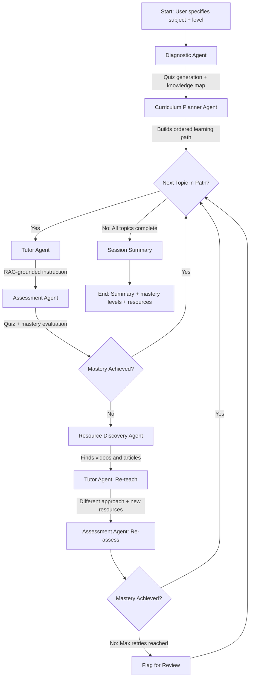

# Multi-Agent Adaptive Tutoring System

## Preliminary Design Document

## 1. Project Summary

A multi-agent tutoring system that assesses a learner's knowledge gaps on any user-specified subject, builds a personalized learning path, delivers instruction through conversational tutoring, evaluates understanding through adaptive quizzing, and discovers relevant external resources (YouTube videos, articles, documentation). Agents collaborate through LangGraph, using RAG over curated and discovered materials, with a Streamlit frontend.

## 2. Problem Statement

Existing LLM tutoring tools are single-pass: you ask a question, you get an answer. They lack the ability to:

- Assess what you already know before teaching
- Build a structured learning path with prerequisite ordering
- Adapt instruction based on your performance on assessments
- Discover and recommend the best external resources for your specific gaps
- Track progress across a learning session and adjust accordingly

While a single LLM conversation can attempt all of these tasks, it does so with degrading context quality, no structured state management, and no guaranteed pedagogical flow. Decomposing into specialized agents with explicit orchestration produces more reliable, inspectable, and adaptive tutoring behavior.

## 3. System Architecture

### 3.1 Agents

#### Diagnostic Agent
- **Role:** Assess the learner's current knowledge level on the specified subject
- **How:** Generates a series of calibration questions at varying difficulty levels. Analyzes responses to identify which concepts the learner knows, partially knows, or doesn't know.
- **Output:** A learner profile (knowledge map) with per-concept mastery scores
- **Tools:** Quiz generation, response evaluation

#### Curriculum Planner Agent
- **Role:** Build a personalized learning path based on the knowledge gaps identified by the Diagnostic Agent
- **How:** Decomposes the subject into a concept graph (topics and their prerequisites). Compares the learner's knowledge map against the concept graph. Produces an ordered sequence of topics to study, skipping what the learner already knows.
- **Output:** An ordered learning path with estimated time per topic
- **Tools:** Concept graph generation, prerequisite ordering

#### Tutor Agent
- **Role:** Deliver instruction on the current topic in the learning path
- **How:** Retrieves relevant content from the knowledge base (RAG) and generates explanations tailored to the learner's level. Uses analogies and examples appropriate to the learner's background. Can answer follow-up questions within the topic.
- **Output:** Conversational instruction with explanations, examples, and follow-up handling
- **Tools:** RAG retrieval over curated materials, explanation generation

#### Assessment Agent
- **Role:** Evaluate the learner's understanding after instruction on each topic
- **How:** Generates quiz questions (multiple choice, short answer, conceptual) targeted at the topic just taught. Evaluates responses and determines whether the learner has sufficient mastery to move on, or needs reinforcement.
- **Output:** Per-topic mastery score, decision to advance or revisit
- **Tools:** Question generation, answer evaluation, mastery threshold logic

#### Resource Discovery Agent
- **Role:** Find and recommend external learning resources for topics where the learner needs reinforcement
- **How:** Uses web search to find YouTube videos, tutorials, articles, and documentation relevant to the specific concept the learner is struggling with. Ranks results by relevance and estimated quality.
- **Output:** A curated list of 3-5 resources per topic, with descriptions of why each is relevant
- **Tools:** Web search, YouTube API (or web search scoped to YouTube), result ranking

### 3.2 Agent Orchestration (LangGraph)

The agents operate in a state machine managed by LangGraph. The following diagram shows the overall flow:



### 3.3 Shared State (LangGraph State)

The LangGraph state object tracks everything agents need:

```python
class TutoringState(TypedDict):
    # Learner info
    subject: str
    learner_level: str                    # beginner, intermediate, advanced
    knowledge_map: dict[str, float]       # concept -> mastery score (0-1)

    # Curriculum
    concept_graph: list[dict]             # concepts with prerequisites
    learning_path: list[str]              # ordered topics to cover
    current_topic_index: int

    # Session tracking
    topics_completed: list[str]
    topics_needing_review: list[str]
    assessment_history: list[dict]        # per-topic quiz results
    resources_recommended: list[dict]

    # Conversation
    messages: list                        # chat history for tutor interaction
    current_phase: str                    # "diagnosis", "planning", "tutoring",
                                          # "assessment", "resource_discovery"
```

### 3.4 RAG Layer

#### Curated Knowledge Base
- User or admin can upload documents (PDFs, markdown, text) as source material for any subject
- Documents are chunked, embedded, and stored in a Chroma vector store
- The Tutor Agent retrieves from this store when delivering instruction
- Metadata filtering by subject and topic

## 4. RAG Integration Details

RAG is not a bolted-on feature here. It serves two distinct purposes:

1. **Grounded instruction:** The Tutor Agent retrieves from curated materials to ensure explanations are accurate and aligned with source content, reducing hallucination. This is critical for tutoring where factual correctness matters.

2. **Resource-informed re-teaching:** When the Resource Discovery Agent finds external resources for a struggling learner, summaries of those resources are passed as context to the Tutor Agent's re-teaching prompt. This allows the Tutor to adjust its approach on the second attempt (e.g., referencing a visual explanation style from a discovered video) without requiring a separate vector store.

## 5. Tech Stack

| Component | Technology |
|---|---|
| LLM | OpenRouter (model flexible) |
| Agent framework | LangChain / LangGraph |
| Vector store | Chroma / pgvector |
| Web search | LangChain web search tools, YouTube Data API |
| Frontend | Streamlit |
| Data models | Pydantic |
| Language | Python |

## 6. Team Split (3 people, 4-5 weeks)

### Person A: Diagnostic Agent + Curriculum Planner Agent

| Week | Tasks |
|---|---|
| 1 | LangChain/LangGraph learning. Build the Diagnostic Agent: calibration quiz generation, response evaluation, knowledge map construction. |
| 2 | Build the Curriculum Planner: concept graph generation for arbitrary subjects, prerequisite ordering, learning path construction from knowledge gaps. |
| 3 | Integration with the shared LangGraph state. Refine diagnostic accuracy: does the knowledge map correctly reflect what the learner knows? |
| 4-5 | Handle edge cases (learner knows everything, learner knows nothing, ambiguous responses). Polish and evaluation. |

### Person B: Tutor Agent + RAG Layer + Resource Discovery Agent

| Week | Tasks |
|---|---|
| 1 | LangChain/LangGraph learning. Set up Chroma vector store, document upload and chunking pipeline. |
| 2 | Build the Tutor Agent: RAG-grounded instruction delivery, follow-up question handling, adaptive explanation depth based on learner level. |
| 3 | Build the Resource Discovery Agent: web search for YouTube videos and articles, result ranking, integration with the re-teaching loop. |
| 4-5 | Tune retrieval quality. Integration and polish. |

### Person C: Assessment Agent + Streamlit Dashboard + Orchestration

| Week | Tasks |
|---|---|
| 1 | LangChain/LangGraph learning. Set up the LangGraph state machine and orchestration flow. |
| 2 | Build the Assessment Agent: quiz generation per topic, answer evaluation, mastery threshold logic, advance/reinforce decision. |
| 3 | Build the Streamlit frontend: subject input, diagnostic quiz UI, learning path visualization, tutoring chat interface, quiz interface, progress dashboard. |
| 4-5 | End-to-end integration. Session summary generation. Polish and evaluation. |

## 7. Streamlit Frontend Design

### Pages/Views

**1. Start Page**
- User enters the subject they want to learn
- Optionally uploads reference materials (PDFs, notes)
- Selects self-assessed level (beginner/intermediate/advanced)

**2. Diagnostic Quiz**
- Series of calibration questions presented one at a time
- Results in a visual knowledge map (concept mastery heatmap or bar chart)

**3. Learning Path View**
- Shows the generated learning path as an ordered list or graph
- Highlights completed topics, current topic, and upcoming topics
- Shows estimated session duration

**4. Tutoring Chat**
- Conversational interface for the current topic
- Tutor explains, learner asks follow-ups
- "I'm ready for a quiz" button to trigger assessment

**5. Quiz Interface**
- Assessment questions for the current topic
- Immediate feedback on answers
- Shows mastery result and whether advancing or revisiting

**6. Resource Recommendations**
- When reinforcement is needed, shows discovered YouTube videos and articles
- Embedded video previews where possible
- Links to external resources

**7. Session Summary**
- Topics covered with mastery levels
- Concepts needing further review
- All recommended resources consolidated
- Progress visualization

## 8. Where the Agentic Complexity Lives

This is not just "5 LLM calls in sequence." The genuine multi-agent challenges are:

1. **Adaptive closed loop:** The Assessment Agent's output determines whether the learner advances, revisits with the Tutor (using a different approach), or gets external resources. This loop can execute multiple times per topic, and the agents must adapt their behavior based on prior attempts.

2. **State-dependent behavior:** The Tutor Agent teaches differently on a second attempt than on the first. If the learner failed the quiz, the Tutor retrieves different content, uses different analogies, or simplifies. The Resource Discovery Agent searches for content specifically targeting the concept the learner struggled with, not generic topic content.

3. **Cross-agent dependency:** The Curriculum Planner's concept graph affects the Assessment Agent's question difficulty. The Diagnostic Agent's knowledge map affects the Tutor Agent's explanation depth. The Resource Discovery Agent's findings feed back into the Tutor Agent's re-teaching materials.

4. **Dynamic re-planning:** If the learner struggles significantly with a topic, the Curriculum Planner may need to insert prerequisite topics that weren't originally in the path. This is a re-planning step triggered by assessment results.

## 9. Research Questions

- Does multi-agent decomposition (separate diagnosis, tutoring, assessment, resource discovery) produce better learning outcomes than a single-agent tutor given the same content?
- How many assessment-reinforcement cycles are needed per topic before mastery, and does this vary by subject domain?
- Does RAG-grounded instruction reduce factual errors compared to ungrounded LLM tutoring?
- Does the Resource Discovery Agent surface resources that are genuinely helpful for the specific gap, or just topically related?
- How accurate is the Diagnostic Agent's initial knowledge assessment compared to the learner's actual performance during the session?

## 10. Demo Scenarios

1. **Complete beginner:** User says "teach me Python" with no prior knowledge. System diagnoses as beginner, builds a path from variables to functions to data structures, tutors through each, quizzes, and recommends YouTube tutorials for reinforcement.

2. **Partial knowledge:** User says "teach me machine learning" and demonstrates knowledge of linear algebra and basic statistics in diagnosis. Planner skips prerequisites, focuses on the ML-specific concepts. Shows the system's ability to personalize the path.

3. **Struggling learner:** User intentionally answers quiz questions wrong. System triggers reinforcement: Tutor re-teaches with a different approach, Resource Discovery finds relevant videos, re-assesses. Shows the adaptive loop in action.

4. **Advanced learner:** User demonstrates strong knowledge in diagnosis. System generates a short, focused path covering only advanced gaps. Shows the system doesn't waste time on known material.

## 11. Differentiation from Existing Work

Existing multi-agent tutoring systems in the literature (GenMentor, GraphMASAL, LPITutor) are typically:

- Focused on a single domain (e.g., one course)
- Require pre-built knowledge graphs
- Don't integrate web-based resource discovery
- Are evaluated in controlled academic settings, not as interactive products

This project differs by:

- Supporting any user-specified subject (the concept graph is generated dynamically by the LLM, not pre-built)
- Combining curated RAG materials with live web resource discovery
- Implementing the full diagnose-plan-teach-assess-discover loop as an interactive Streamlit app
- Being demo-ready and portfolio-visible, not just a research prototype